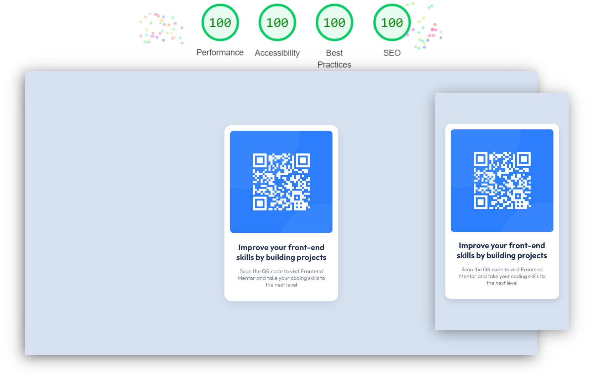

# Frontend Mentor - QR code component solution



This is a solution to the [QR code component challenge on Frontend Mentor](https://www.frontendmentor.io/challenges/qr-code-component-iux_sIO_H). Frontend Mentor challenges help you improve your coding skills by building realistic projects.

## Table of contents

- [Links](#links)
- [My process](#my-process)
  - [Built with](#built-with)
  - [What I learned](#what-i-learned)
- [Author](#author)
- [Acknowledgements](#acknowledgements)

## Links

- Solution URL: [https://www.frontendmentor.io/solutions/ ...](https://www.frontendmentor.io/solutions/card-component-build-with-sass-using-partials-and-utility-classes-ByOipGK79)
- Live Site URL: [https://mateusabelli.github.io/qr-code-component/](https://mateusabelli.github.io/qr-code-component/)

## My process

### Built with

- HTML 5
- CSS 3
  - Custom properties
  - Flexbox
  - CSS Grid
  - Mobile-first workflow

### What I learned

This is my second time solving this challenge, in my first solution I've learned a lot about SASS, folder structure and setting up a dev environment.

In this solution I took a step back and simplified everything while also making sure everything had good accessibility where applicable. I've learned how to make QR Codes accessible for screen reader users.

```html

<a class="sr-only" href="https://www.frontendmentor.io/">QR Code link</a>
```

```css
.sr-only {
  position: absolute;
  width: 1px;
  height: 1px;
  padding: 0;
  margin: -1px;
  overflow: hidden;
  clip: rect(0, 0, 0, 0);
  white-space: nowrap;
  border-width: 0;
}
```

## Author

- Website - [github.com/mateusabelli](https://github.com/mateusabelli)
- Frontend Mentor - [@mateusabelli](https://www.frontendmentor.io/profile/mateusabelli)

## Acknowledgements

- [Modern CSS Reset (Snippets)](https://piccalil.li/blog/a-modern-css-reset/)
- [TailwindCSS (Snippets)](https://tailwindcss.com/docs/screen-readers)
