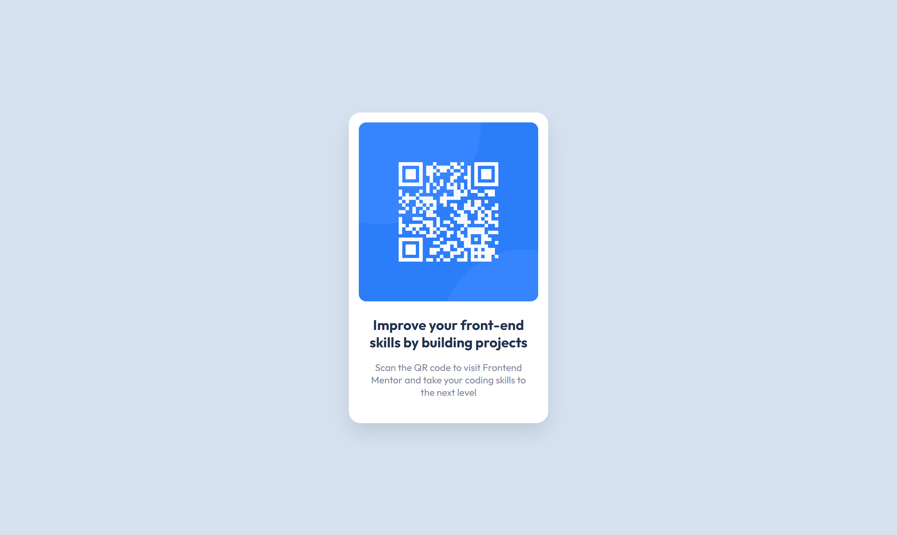

# Frontend Mentor - QR code component solution

This is a solution to the [QR code component challenge on Frontend Mentor](https://www.frontendmentor.io/challenges/qr-code-component-iux_sIO_H). Frontend Mentor challenges help you improve your coding skills by building realistic projects. 

## Table of contents

- [Overview](#overview)
  - [Screenshot](#screenshot)
  - [Links](#links)
- [My process](#my-process)
  - [Built with](#built-with)
  - [What I learned](#what-i-learned)
  - [Continued development](#continued-development)
  - [Useful resources](#useful-resources)
- [Author](#author)

## Overview

### Screenshot

 

### Links

- Solution URL: [Add solution URL here](https://your-solution-url.com)
- Live Site URL: [QR code component](https://mateusabelli.github.io/qr-code-component/)

## My process

### Built with


- [Sass](https://sass-lang.com/) - CSS Preprocessor
- [Modern CSS Reset](https://piccalil.li/blog/a-modern-css-reset/) - A CSS Reset by Andy Bell
- Sass partials
- Utility classes
- 4.1 Sass folder structure

### What I learned

I've learned a lot about Sass, how to use it for a simple project and how to set up a dev environment with NPM scripts to watch and build the generated CSS.

I also learned about partials and file organization, most of my study came from [Kevin Powell's](https://www.youtube.com/channel/UCJZv4d5rbIKd4QHMPkcABCw) YouTube channel.


Here is an example of a component being built with utility classes, the idea here is that at any moment I can change it from a ```bg-white``` to ```bg-dark``` as well as modify other properties easily.

```html
<div class="card-container grid bg-white padding br-1" style="--gap: 1.5rem;">
[...]
</div>
```
Here is an example of my color utility classes that I use through my HTML
```scss
.bg-dark { background-color: hsl( $clr-dark-blue ); }
.bg-white { background-color: hsl( $clr-white ); }
.bg-light { background-color: hsl( $clr-light-grey ); }
.bg-greyish { background-color: hsl( $clr-greyish-blue ); }
```

### Continued development

After finishing this project I started to learn PostCSS and I want to continue evolving my front-end skills by understanding better workflows as well as building a solid foundation in CSS.

### Useful resources

- [PX to REM Converter](https://nekocalc.com/px-to-rem-converter) - This helped me to build my typography
- [Sass Guidelines](https://sass-guidelin.es/) - This is an amazing website which helped me to learn SASS and organize my files
- [Learn Sass in 20 minutes](https://www.youtube.com/watch?v=Zz6eOVaaelI) This tutorial by Dev Ed helped me a lot to get started writing my first lines of Sass.
- [Kevin Powell](https://www.youtube.com/channel/UCJZv4d5rbIKd4QHMPkcABCw) This YouTube channel has a lot of great videos that helped me with this project 

## Author

- Frontend Mentor - [@MateusAbelli](https://www.frontendmentor.io/profile/MateusAbelli)